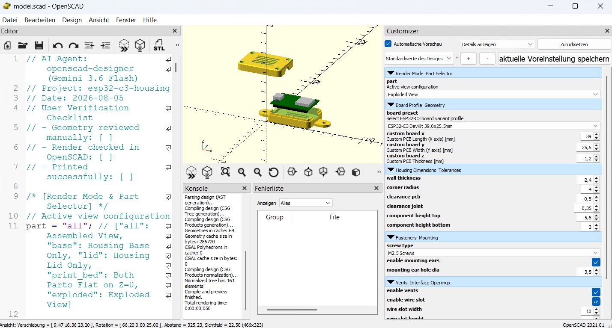
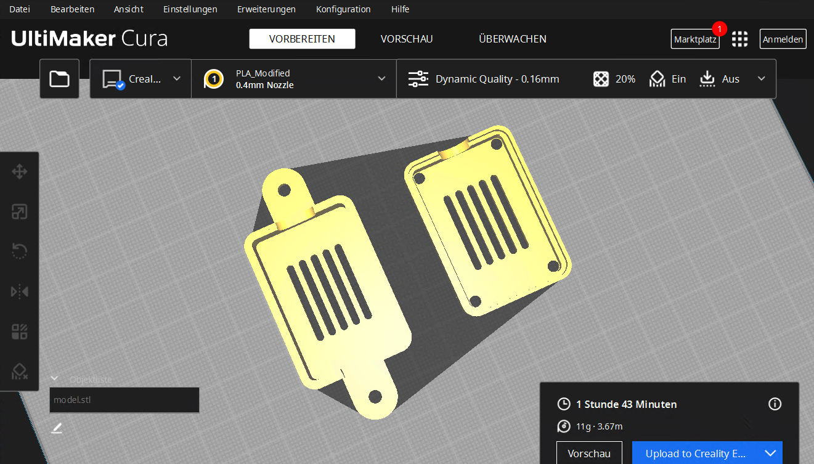

# OpenSCAD Agent Skill Suite

[](https://openscad.org)
[](https://github.com/topics/antigravity)
[](LICENSE)

This repository provides an OpenSCAD skill suite for agent-driven model generation and validation.
It supports parametric OpenSCAD output, FDM printability checks, headless preview rendering, and optional slicer CLI metrics.

| Preview | Description |
|---|---|
|  | Parametric model rendering via OpenSCAD |
|  | Slice-ready preview from slicer output |

---

## Overview

The skill suite supports agent-driven workflows for OpenSCAD model creation and validation.

Main capabilities:
- parametric OpenSCAD generation
- FDM printability checks
- headless preview rendering
- optional slicer CLI integration for print time and filament metrics

---

## Quickstart

1. Copy the `.agents/` and `ai/` folders into your Antigravity workspace root.

2. Confirm prerequisites:
- OpenSCAD installed and available on PATH or at `C:\Program Files\OpenSCAD\openscad.com`
- Optional: PrusaSlicer CLI or OrcaSlicer CLI for slicer metrics

3. Run a prompt in Antigravity, for example:
```bash
/openscad-designer Create a 2-part self-draining soap holder with snap fits
```

---

## Features

- Parametric model generation with OpenSCAD
- Printability validation for common FDM constraints
- Headless preview rendering using OpenSCAD CLI
- Optional slicer-based metrics for print time and filament mass
- Model metadata logged in `model_log.json`

---

## Available Skills

- `/openscad-designer`: generate parametric `.scad` files from natural language
- `/fdm-printability-auditor`: run printability and collision checks
- `/preview-scad`: render preview images from OpenSCAD models
- `/export-stl`: export `.scad` to binary `.stl`
- `/validate-model`: validate geometry, parameters, and overhangs

---

## Repository Structure

```
openSCADSkill/
├── .agents/
│   ├── AGENTS.md
│   └── skills/
│       ├── openscad-designer/
│       ├── fdm-printability-auditor/
│       ├── preview-scad/
│       ├── export-stl/
│       ├── stl-to-openscad/
│       └── validate-model/
├── ai/
│   └── shared/
│       ├── instructions/
│       └── scripts/
├── media/
└── models/
```

---

## Use Cases

Suitable for:
- parametric enclosures and housings
- mechanical parts with defined fits and clearances
- generated CAD geometry from an agent workflow

Not intended for:
- organic or sculpted forms
- mesh repair or high-polygon mesh editing

---

## Tested Environment

- Windows 11, Linux, macOS
- Google Antigravity IDE V2.1.1
- PowerShell 7+ or Bash-compatible shell
- OpenSCAD 2021.01+
- Optional: PrusaSlicer CLI, OrcaSlicer CLI

---

## License

MIT License.