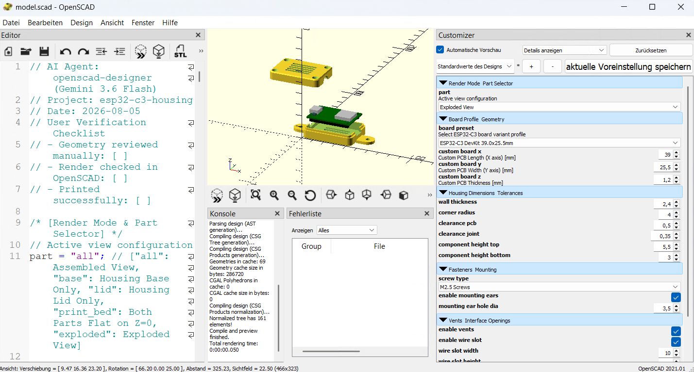
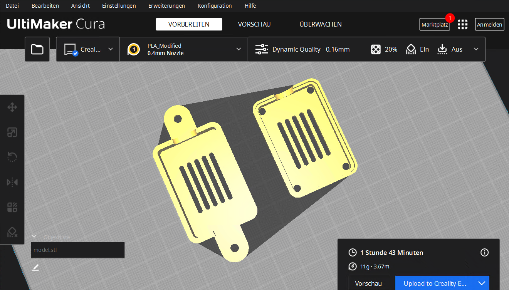
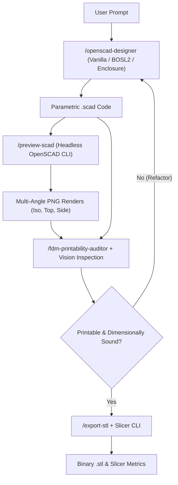

# OpenSCAD Agent Skill Suite

[](https://openscad.org)
[](https://github.com/topics/antigravity)
[](https://github.com/BelfrySCAD/BOSL2)
[](LICENSE)

An agent-driven skill suite for **OpenSCAD** parametric 3D model generation, FDM printability validation, headless preview rendering, and slicer CLI metric calculation.

| Parametric Model Render (`/preview-scad`) | Slicer & Printability Metrics (`/export-stl`) |
|:---:|:---:|
|  |  |

---

## Agent Workflow Architecture


```mermaid
graph TD
    A["User Prompt"] --> B["/openscad-designer (Vanilla / BOSL2 / Enclosure)"]
    B --> C["Parametric .scad Code"]
    C --> D["/preview-scad (Headless OpenSCAD CLI)"]
    D --> E["Multi-Angle PNG Renders (Iso, Top, Side)"]
    E --> F["/fdm-printability-auditor + Vision Inspection"]
    C --> F
    F --> G{"Printable & Dimensionally Sound?"}
    G -- "No (Refactor)" --> B
    G -- "Yes" --> H["/export-stl + Slicer CLI"]
    H --> I["Binary .stl & Slicer Metrics"]
```

---

## Quickstart

### 1. Installation

Copy the `.agents/` and `ai/` directories into your workspace root:

```bash
# PowerShell / Bash
cp -r .agents/ ai/ /path/to/your/workspace/
```

### 2. Prerequisites

- **OpenSCAD 2021.01+** on PATH or configured via `OPENSCAD_PATH` (e.g. `C:\Program Files\OpenSCAD\openscad.com`).
- **BOSL2 Library** *(Required for BOSL2 models)*: The agent automatically detects if BOSL2 is missing and offers to clone it for you on demand. Alternatively, install it manually:
  ```bash
  # Windows (PowerShell)
  git clone https://github.com/BelfrySCAD/BOSL2.git "$HOME\Documents\OpenSCAD\libraries\BOSL2"
  ```
- *(Optional)* **PrusaSlicer CLI** or **OrcaSlicer CLI** for automated print time & filament consumption metrics.

### 3. Example Prompts

Run prompts directly in your agent interface:

```bash
# Core Workflow: Generate a snap-fit soap holder with vanilla OpenSCAD
/openscad-designer Create a 2-part self-draining soap holder with snap fits

# Inspect multi-view renders of an existing model
/preview-scad models/soap-holder/model.scad

# Audit FDM printability & overhangs
/fdm-printability-auditor models/soap-holder/model.scad

# (Experimental) Generate rounded enclosure with BOSL2 attachments
# /openscad-bosl2-designer Create a parametric junction box with rounded corners and M3 screw bosses
```

---

## Available Skills

### Core Skills (Shipped in Main Repository)

| Command | Engine / Library | Focus / Capabilities | Output |
|---|---|---|---|
| `/openscad-designer` | Vanilla OpenSCAD | Pure SCAD geometry, CSG operations & basic primitives | `.scad` |
| `/preview-scad` | OpenSCAD CLI | Headless offscreen 3D viewport rendering (`--imgsize`) | `.png` |
| `/fdm-printability-auditor` | Rule Engine | Wall thickness, overhang angles, clearances & collision checks | Audit Report |
| `/export-stl` | OpenSCAD CLI | Convert parametric `.scad` to binary `.stl` mesh | `.stl` |
| `/validate-model` | Geometry Auditor | Validate geometry parameters, sanity limits & overhangs | Validation Log |

### 🧪 Experimental Skills (In Active Development)

> [!NOTE]
> The following skills are currently under active development, prototyping, and benchmarking. They are being stabilized and will be merged into the main release once validated.

| Command | Status | Engine / Library | Focus / Capabilities | Output |
|---|:---:|---|---|---|
| `/openscad-bosl2-designer` | 🧪 Experimental | BOSL2 Library | Advanced attachments, anchors, mask rounding & fillets | `.scad` |
| `/openscad-enclosure-designer` | 🧪 Experimental | jl_scad + BOSL2 | PCB project boxes, standoffs, vents & snap-fit lids | `.scad` |
| `/stl-to-openscad` | 🧪 Experimental | Mesh Converter | Re-import or reference STL meshes inside OpenSCAD | `.scad` |
| `/gh-issue-model-bot` | 🧪 Experimental | GitHub Actions API | Scans GitHub issues for model prompts, generates CAD & replies | Issue PR / Comment |
| `/reference-benchmark-analyst` | 🧪 Experimental | Repos & Web Parser | Benchmark external CAD repos, compare features & tech stacks | Markdown Proposal |

---

## Featured Model Showcase

This repository includes tracked reference models in [`samples/`](samples/):

### 📦 Electronics & Mechanical Assemblies
- 🪴 **[Self-Watering Planter](samples/self-watering-planter)** — 2-part nested planter (inner strainer + outer water reservoir)
- 💨 **[PC Desk Fan Airflow Nozzle](samples/pc-desk-fan-amplifier)** — 120mm fan duct amplifier using BOSL2 hull geometry
- 🔩 **[Threaded Canister](samples/threaded-canister)** — Storage jar with BOSL2 ISO threads & knurled cap grip
- 🎛️ **[35mm DIN-Rail Bracket](samples/din-rail-bracket)** — EN 50022 mounting clip with spring latch & screw holes
- 📦 **[Wemos D1 LED Controller](samples/wemos-d1-led-controller)** — Microcontroller housing with snap-fit lid

### 🛠️ Desk & Workshop Accessories
- 🚪 **[WC Doorframe Sign](samples/wc-doorframe-sign)** — Dual-color door sign with chamfered frame mounting
- 🗃️ **[Gridfinity SD & USB Bin](samples/gridfinity-sd-usb-bin)** — Modular Gridfinity tray with SD card & USB slots
- 🐝 **[Honeycomb Wall Panel](samples/honeycomb-wall-panel)** — Interlocking hex grid with countersunk screw holes
- 🧵 **[Spool Hub Adapter](samples/spool-hub-adapter)** — Tapered 50–75mm spool ring with 608ZZ bearing seat
- 📎 **[Compliant Bag Sealing Clip](samples/compliant-bag-clip)** — 1-piece print-in-place clip with living hinge
- 📷 **[GoPro Battery Box](samples/gopro-battery-box)** — Compact multi-battery travel case with latch
- 🎮 **[Xbox Controller Wallmount](samples/xbox-controller-wallmount)** — Ergonomic wall bracket

---

## Features

- **Parametric Generation**: Code-first OpenSCAD modeling with customizable parameters.
- **BOSL2 & jl_scad Integration**: Native support for modern OpenSCAD library features (anchors, rounded edges, PCB bosses).
- **FDM Printability Validation**: Automated checks for overhangs, thin walls, bridge spans, and clearances.
- **Headless Preview Rendering**: Automatic camera positioning and offscreen PNG generation via OpenSCAD CLI.
- **Slicer Metric Extraction**: Optional slicer CLI parsing for exact print duration and filament usage (grams / meters).
- **Metadata Logging**: Full tracking of generated model parameters and audit results in `model_log.json`.

---

## Repository Structure

```
openSCADSkill/
├── .agents/
│   ├── AGENTS.md
│   └── skills/
│       ├── openscad-designer/          # Core: Vanilla OpenSCAD CAD generation
│       ├── preview-scad/               # Core: Headless CLI multi-angle rendering
│       ├── fdm-printability-auditor/   # Core: FDM printability validation
│       ├── export-stl/                 # Core: Binary STL export & slicer metrics
│       ├── validate-model/             # Core: Geometry & parameter auditor
│       ├── openscad-bosl2-designer/    # [Experimental] BOSL2 anchor & attachments
│       ├── openscad-enclosure-designer/# [Experimental] Enclosure builder (jl_scad)
│       ├── stl-to-openscad/            # [Experimental] STL mesh re-import
│       ├── gh-issue-model-bot/         # [Experimental] Issue-driven model bot
│       └── reference-benchmark-analyst/# [Experimental] External CAD benchmark tool
├── ai/
│   └── shared/
│       ├── instructions/
│       └── scripts/
├── media/
├── samples/              # Tracked reference models & visual previews
└── models/               # Local runtime directory for generated outputs (.gitignore)
```

---

## Use Cases

**Ideal for:**
- Parametric electronics enclosures, housings, and mounting brackets
- Mechanical parts with specified tolerances, snap fits, and clearances
- Automated end-to-end 3D model generation pipelines

**Not intended for:**
- Sculpted or organic 3D shapes (sculpting mesh modeling)
- High-polygon mesh repair or topology retopology

---

## Tested Environment

- **OS**: Windows 11, Linux, macOS
- **IDE**: Google Antigravity IDE V2.1.1+
- **Shell**: PowerShell 7+ or Bash
- **CAD**: OpenSCAD 2021.01+
- **Slicers (Optional)**: PrusaSlicer CLI, OrcaSlicer CLI

---

## Related Links

- [OpenSCAD Official Website](https://openscad.org)
- [BOSL2 Library Documentation](https://github.com/BelfrySCAD/BOSL2)
- [OpenSCAD MCP Server](https://github.com/fboldo/openscad-mcp-server)
- [OpenSCAD Skill Reference](https://github.com/swh/openscad-skill)

---

## License

[MIT License](LICENSE)