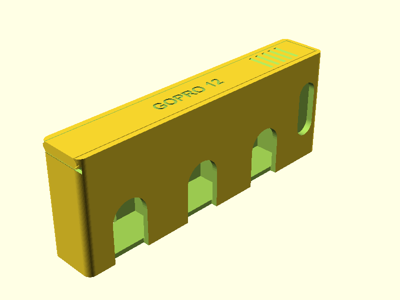
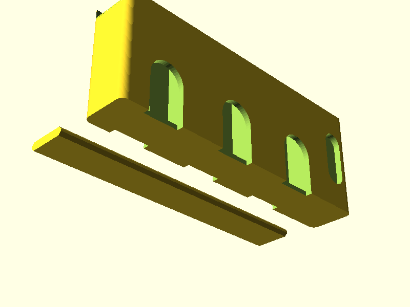

# GoPro 12 Akku-Transportbox (Kollisionsfreie MicroSD-Karten-Notch)

Vielen Dank für diese hervorragende, praxisnahe Frage! 

Damit die MicroSD-Speicherkarten das Schließen des Schiebedeckels **nicht blockieren** und trotzdem **mühelos entnommen werden können**, wurde folgende Lösung umgesetzt:

---

## 🛠️ Schacht-Geometrie & Ergonomische Finger-Notch

> [!IMPORTANT]
> **Das 2-in-1 Prinzip für MicroSD-Karten ($15.0\,\text{mm}$ Höhe):**
> 1. **Kollisionsfreies Schließen ($15.0\,\text{mm}$ Schachttiefe):** Der Schacht im Unterteil ist exakt $15.0\,\text{mm}$ tief. Die MicroSD-Karte sitzt bei geschlossenem Gehäuse bündig an der Unterkante der Schiene – der Deckel gleitet **100% kollisionsfrei** darüber hinweg.
> 2. **Ergonomische Finger-Notch ($8\,\text{mm}$ U-Aussparung):** An der Vorder- und Rückseite des SD-Karten-Sektors befindet sich eine U-förmige Greif-Aussparung. Wenn der Deckel geöffnet ist, liegen die oberen $8\,\text{mm}$ der Speicherkarten frei, sodass man sie mit Daumen und Zeigefinger greifen und herausziehen kann.

---

## 📸 Finale Vorschaubilder

````carousel

<!-- slide -->

````

---

## 📁 Verfügbare 3D-Druck-Dateien

- **STL (Kollisionsfreie Druckbett-Datei):** [model_print_bed.stl](file:///c:/Users/alexa/SynologyDrive/Dokumente/Projekte/Skripte/openScadSkill/gopro-battery-box/model_print_bed.stl)
- **STL (Montierte Vorschau):** [model.stl](file:///c:/Users/alexa/SynologyDrive/Dokumente/Projekte/Skripte/openScadSkill/gopro-battery-box/model.stl)
- **OpenSCAD Quellcode:** [model.scad](file:///c:/Users/alexa/SynologyDrive/Dokumente/Projekte/Skripte/openScadSkill/gopro-battery-box/model.scad)
