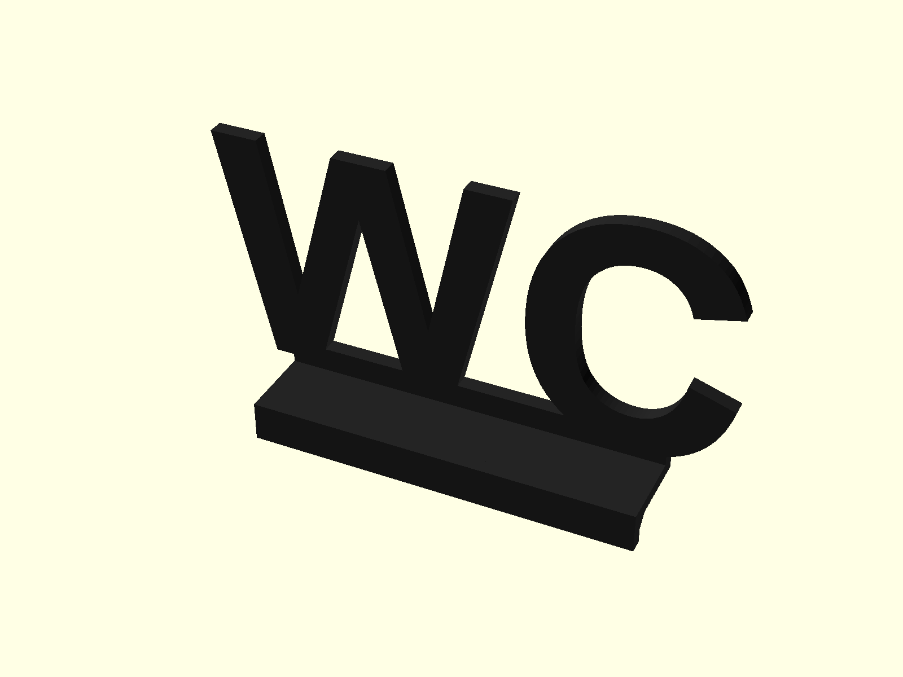
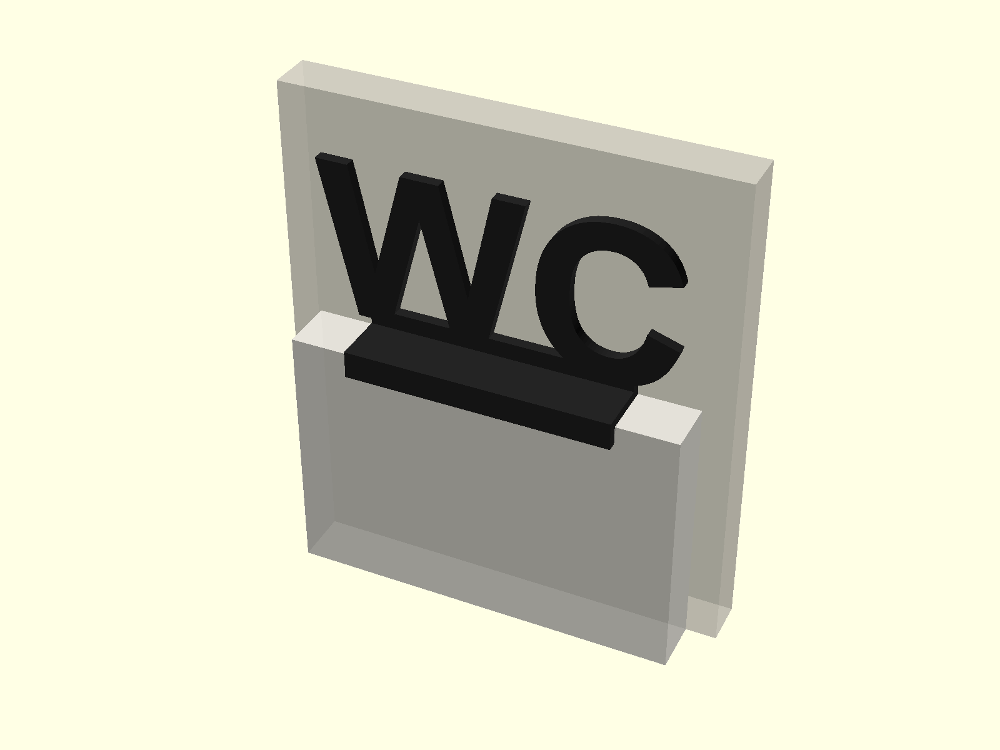
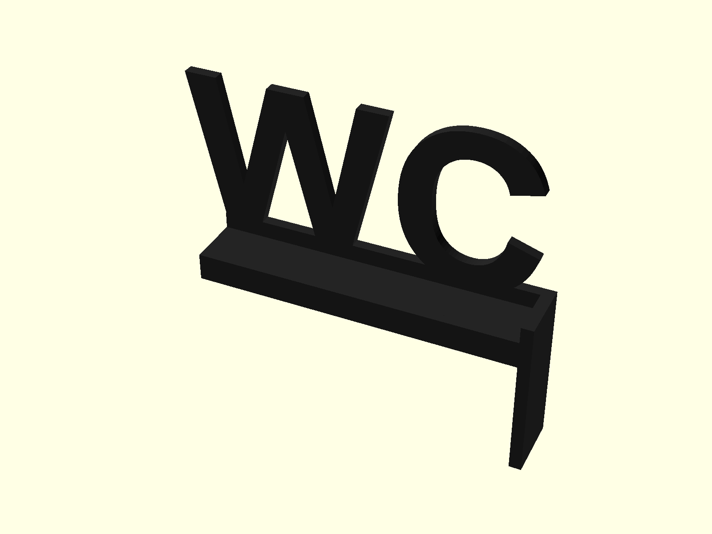

# Modern WC Doorframe Sign (3D Printable)

A minimalist, architectural doorframe topper sign featuring the letters **"WC"**, designed to rest with maximum stability on top of standard door casing / molding. Optimized for matte black filament 3D printing.

---

## Previews

| Standard Silhouette (Rear-Aligned) | Installed on Doorframe (Simulation with Wall) | Corner Wrap Style |
| :---: | :---: | :---: |
|  |  |  |

---

## Features & Highlights

- **Rear-Mounted Center of Gravity**: Letters are mounted on the rear edge of the base plate, placing their weight directly above the back of the trim and against the wall for optimal stability.
- **Zero-Support Printing**: Pre-oriented for printing flat on the build plate with 0° overhangs and zero waste.
- **Self-Locating Lip**: Sits naturally on the horizontal doorframe trim with a front lip (6 mm drop) that locks against the front edge and prevents shifting.
- **4 Design Variants**:
  1. `silhouette` (Default): Modern bold connected typography.
  2. `bar`: Elevated floating letters on an accent rail.
  3. `corner`: Sits on the upper-right corner of the door casing.
  4. `badge`: Arched plaque with negative cutout stencil.
- **Parametric OpenSCAD Source**: Easily customize doorframe depth, letter position (`"back"`, `"front"`, `"center"`), letter height, font, and thickness in the OpenSCAD Customizer GUI.

---

## Recommended Slicer Settings

| Parameter | Recommended Value | Reason |
| :--- | :--- | :--- |
| **Filament** | PLA or PETG (Matte Black recommended) | Crisp shadow contrast and clean modern finish |
| **Print Orientation** | Flat on rear face (see `wc_doorframe_sign_print_ready.stl`) | Maximizes bed contact, zero supports, fast print |
| **Layer Height** | `0.20 mm` (or `0.16 mm` for ultra-smooth letters) | Optimal balance of speed and detail |
| **Perimeters / Walls** | `3` | Ensures rigid solid letter perimeters |
| **Infill** | `15% - 20%` (Gyroid or Grid) | Lightweight and structurally sound |
| **Supports** | **None (0%)** | Fully self-supporting |
| **Print Time** | ~25 - 40 minutes | Fast single-piece print |

---

## Key Dimensions (Default)

- **Letter Height:** 52 mm
- **Sign Width:** ~88 mm (auto-calculated from font)
- **Letter Thickness:** 3.6 mm
- **Letter Position:** `back` (flush against the rear wall plane)
- **Doorframe Ledge Depth:** 18.0 mm (fits standard 12–25 mm door casing tops)
- **Front Retaining Lip:** 6.0 mm drop (fits in front of casing)

---

## Customization (OpenSCAD)

Open [`wc_doorframe_sign.scad`](./wc_doorframe_sign.scad) in [OpenSCAD](https://openscad.org/) to adjust:
- `letter_position`: Choose `"back"` (closest to wall), `"front"`, or `"center"`.
- `doorframe_top_depth`: Match the exact depth of your door molding.
- `front_lip_drop`: Change how far the front lip hangs down.
- `sign_text`: Change the text (e.g. "TOILET", "BATH", "RESTROOM", "01").
- `style`: Switch between `"silhouette"`, `"corner"`, `"badge"`, or `"bar"`.
- `render_mode`: `"assembled"` (visual preview) or `"print_ready"` (laid flat for STL export).

---

## Files Included

- [`wc_doorframe_sign.scad`](./wc_doorframe_sign.scad) - Parametric OpenSCAD source file
- [`wc_doorframe_sign_print_ready.stl`](./wc_doorframe_sign_print_ready.stl) - Print-ready STL pre-oriented flat for 1-click slicing
- [`wc_doorframe_sign.stl`](./wc_doorframe_sign.stl) - Assembled upright model STL
- `preview_iso.png`, `preview_context.png`, `preview_corner.png` - Visual renders
